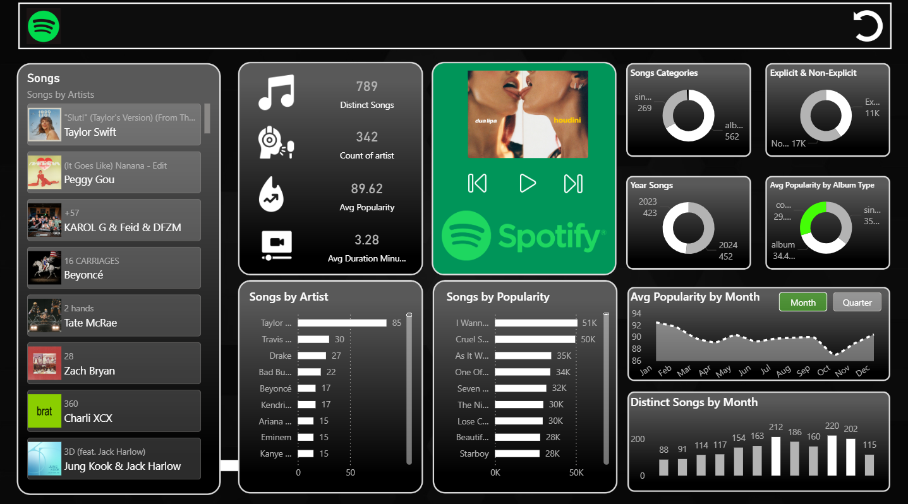

# 🎵 Spotify Top 50 Global Music Trends Dashboard | Power BI

Power BI • DAX • Power Query • Data Visualization

---

## 📝 Project Overview

Music trends evolve quickly, with new songs constantly entering global charts.  
In this project, I explored the **Spotify Top 50 Global dataset** to understand patterns in song popularity, artist presence, and music trends.

Using Power BI, I built an interactive dashboard that transforms raw data into visual insights about artists, songs, and listening patterns.

The dashboard helps explore questions like:

- Which artists dominate global charts?
- How does song popularity change over time?
- What proportion of songs are explicit vs non-explicit?
- How are songs distributed across different months and years?

---

## 📁 Dataset

**Dataset:** Spotify Top 50 Global  
**Source:** Kaggle  

The dataset contains information such as:

- Song title
- Artist name
- Popularity score
- Album type
- Explicit vs non-explicit flag
- Release date
- Song duration

---

## 📊 Dashboard Highlights

The dashboard provides an interactive view of Spotify music trends through:

- KPI cards summarizing key dataset metrics
- Song category distribution
- Explicit vs non-explicit song comparison
- Song distribution by year
- Average popularity across album types
- Popularity trends across months and quarters
- Artist-level song distribution
- Song popularity rankings

Interactive slicers allow users to explore popularity trends by **month and quarter**.

---

## 🔎 Key Insights

Some interesting observations from the dataset:

- Certain artists appear frequently in the Top 50 charts, showing strong global presence.
- Explicit tracks represent a noticeable portion of songs in the dataset.
- Song popularity fluctuates across months, suggesting seasonal trends in music releases.
- Different album types show variations in average popularity scores.

---

## ⚙️ Tools & Technologies

- Microsoft Power BI
- Power Query
- DAX
- Kaggle Dataset

---

## 🧠 Skills Demonstrated

- Data cleaning and transformation
- Data modeling
- DAX calculations
- Dashboard design
- Data visualization
- Data storytelling

---

## 🚧 Future Improvements

Possible enhancements for this project:

- Add genre-based analysis
- Integrate Spotify API for real-time data
- Expand artist-level insights
- Include streaming metrics

---

## 📂 Repository Structure
